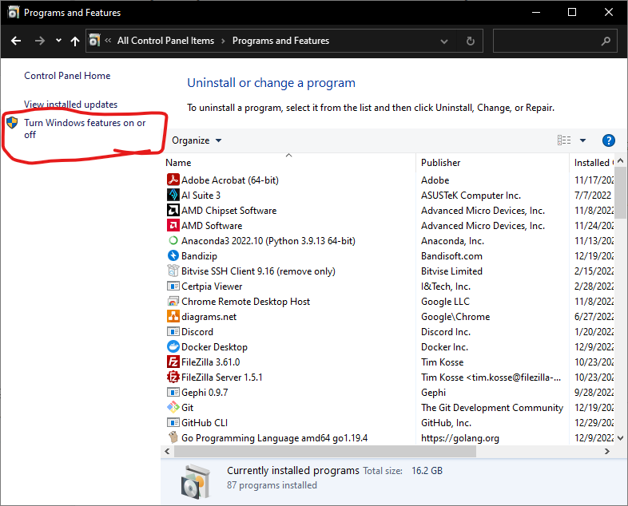
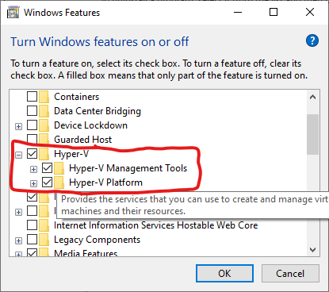
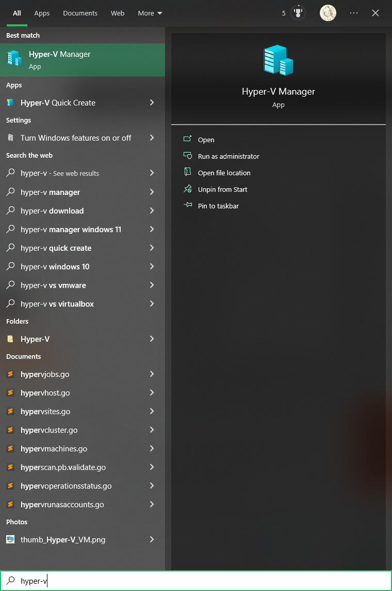
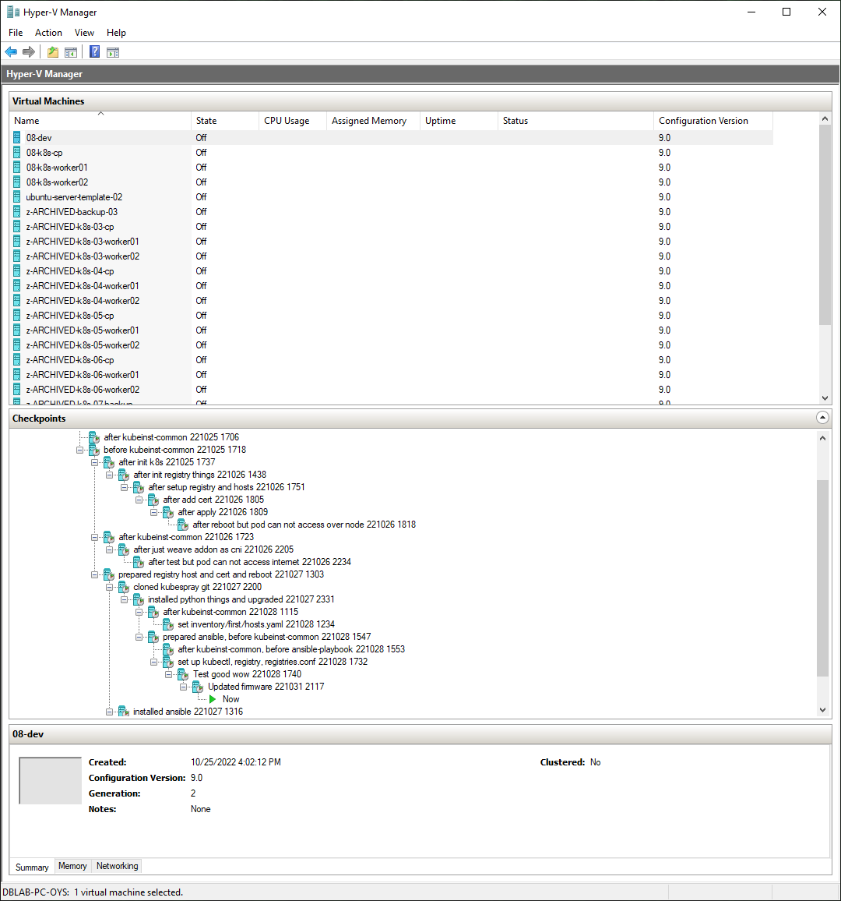

# k8s deployment guide

This guide explains how to deploy k8s(Kubernetes) cluster.

- (Optional) Install Windows terminal and latest Powershell 7.
- Deploy k8s cluster into local machine's virtual machines, using Hyper-V in Windows.
- Make a VM for connect and develop, which is outside of the k8s cluster
- Deploy k8s with _[Kubespray](https://kubespray.io/)_ for convenience

---

## Contents

- [k8s deployment guide](#k8s-deployment-guide)
  - [Contents](#contents)
  - [Environment](#environment)
  - [Step by step guide](#step-by-step-guide)
    - [1. Install _Windows Terminal_ and _Powershell 7_](#1-install-windows-terminal-and-powershell-7)
    - [2. Install Hyper-V](#2-install-hyper-v)
    - [3. Setup NAT](#3-setup-nat)
    - [4. Create VMs](#4-create-vms)
    - [5. Prepare VMs](#5-prepare-vms)
    - [6. Prepare Kubespray](#6-prepare-kubespray)
    - [7. Deploy k8s cluster](#7-deploy-k8s-cluster)
    - [8. Access and use the k8s cluster from _Dev_ VM](#8-access-and-use-the-k8s-cluster-from-dev-vm)

---

## Environment

- Host PC
  - RAM: More than 10GB
  - OS: Windows 10 (Maybe 11 also supports Hyper-V)
- Virtual machine(VM) hypervisor: **Hyper-V**
  - Reason for using Hyper-V
    - Easy to install in Windows
    - Easy to manage with GUI
    - Supports backup function called "Checkpoint", and it's handy
    - Supports powershell command to handle, we will use some commands to handle checkpoints in multiple VMs at once
  - Network (Guide is explained below)
    - Require NAT
    - VMs require static MAC, static IP
- Virtual machines
  - _"Development"_ machine: we will connect and develop in this machine
    - OS: Latest LTS Ubuntu Server (22.04.1 LTS for now)
    - CPU: more than 2 cores for convenience
    - Memory: more than 2 GB for convenience
  - _"Control Plane"_ machine (Control Plane, CP in short, means "Master" node)
    - OS: Latest LTS Ubuntu Server (22.04.1 LTS for now)
    - CPU: 2 cores will be enough
    - Memory: 2 GB will be enough
  - _"Worker Node"_ machines (Worker node means "Slave" node)
    - OS: Latest LTS Ubuntu Server (22.04.1 LTS for now)
    - CPU: 2 cores will be enough
    - Memory: 2 GB will be enough

## Step by step guide

### 1. Install _Windows Terminal_ and _Powershell 7_

### 2. Install Hyper-V

1. In _Control panel_, _Programs and Features_, click _Turn Windows features on or off_

    

2. Find _Hyper-V_, and check all of them

    

3. Press _OK_, then the install process will begin. Reboot may required.
4. After the installation finished, check the program installed. in _Start menu_, type `hyper-v` will show _Hyper-V Manager_. Click that and check the program opens up.

    
    

### 3. Setup NAT

### 4. Create VMs

### 5. Prepare VMs

### 6. Prepare Kubespray

### 7. Deploy k8s cluster

### 8. Access and use the k8s cluster from _Dev_ VM
