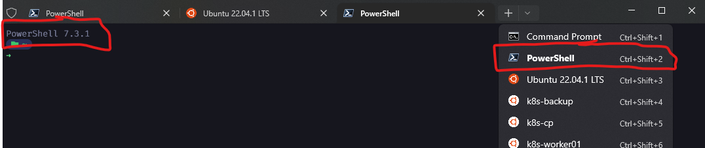
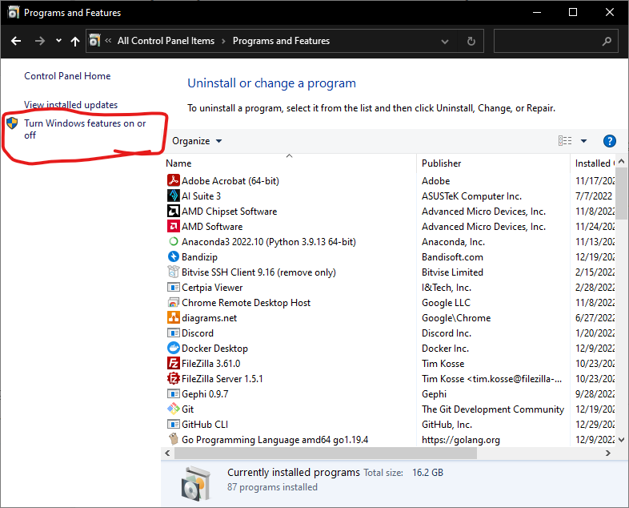
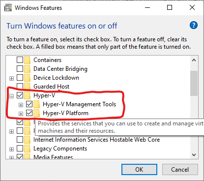
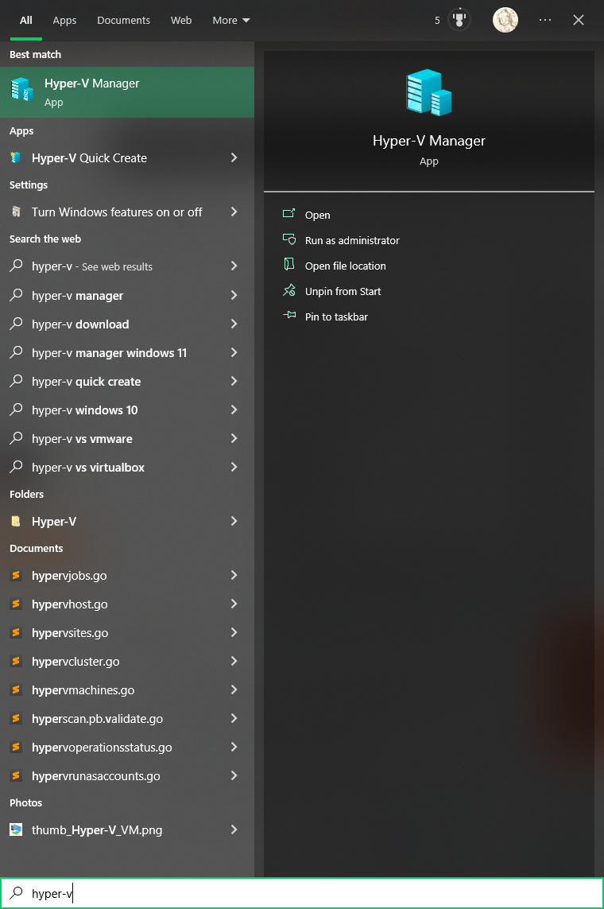
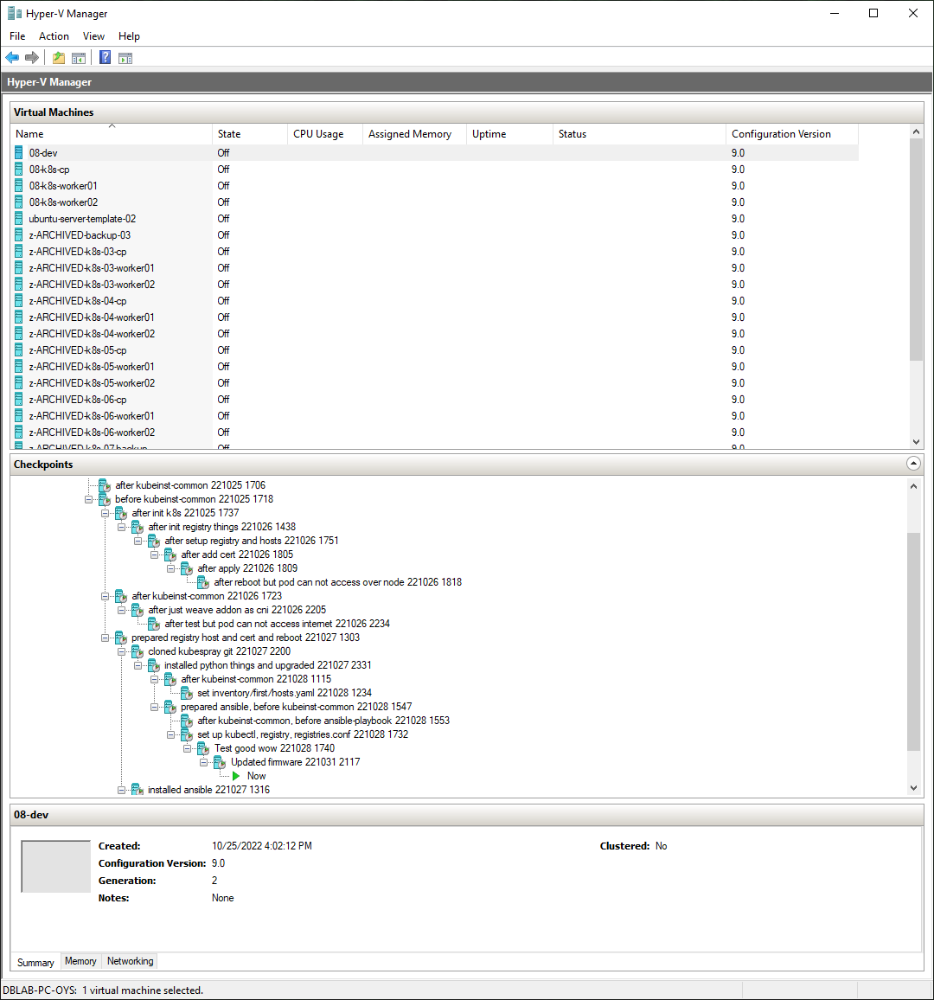

# k8s deployment guide

This guide explains how to deploy k8s(Kubernetes) cluster.

- (Optional) Install Windows terminal and latest Powershell 7.
- Deploy k8s cluster into local machine's virtual machines, using Hyper-V in Windows.
- Make a VM for connect and develop, which is outside of the k8s cluster
- Deploy k8s with _[Kubespray](https://kubespray.io/)_ for convenience

---

## Contents

- [k8s deployment guide](#k8s-deployment-guide)
  - [Contents](#contents)
  - [Environment](#environment)
  - [Step by step guide](#step-by-step-guide)
    - [1. (Optional but recommended) Install _Windows Terminal_ and _Powershell 7_](#1-optional-but-recommended-install-windows-terminal-and-powershell-7)
    - [2. Install Hyper-V](#2-install-hyper-v)
    - [3. Setup NAT](#3-setup-nat)
    - [4. Create VMs](#4-create-vms)
    - [5. Prepare VMs](#5-prepare-vms)
    - [6. Setup checkpoints for VMs](#6-setup-checkpoints-for-vms)
    - [7. Prepare Kubespray](#7-prepare-kubespray)
    - [8. Deploy k8s cluster](#8-deploy-k8s-cluster)
    - [9. Access and use the k8s cluster from _Dev_ VM](#9-access-and-use-the-k8s-cluster-from-dev-vm)

---

## Environment

- Host PC
  - RAM: More than 10GB
  - OS: Windows 10 (Maybe 11 also supports Hyper-V)
  - Virtualization function on BIOS should be turned on
- Virtual machine(VM) hypervisor: **Hyper-V**
  - Reason for using Hyper-V
    - Easy to install in Windows
    - Easy to manage with GUI
    - Supports backup function called "Checkpoint", and it's handy
    - Supports powershell command to handle, we will use some commands to handle checkpoints in multiple VMs at once
  - Network (Guide is explained below)
    - Require NAT
    - VMs require static MAC, static IP
- Virtual machines
  - _"Development"_ machine: we will connect and develop in this machine
    - OS: Latest LTS Ubuntu Server (22.04.1 LTS for now)
    - CPU: more than 2 cores for convenience
    - Memory: more than 2 GB for convenience
  - _"Control Plane"_ machine (Control Plane, CP in short, means "Master" node)
    - OS: Latest LTS Ubuntu Server (22.04.1 LTS for now)
    - CPU: 2 cores will be enough
    - Memory: 2 GB will be enough
  - _"Worker Node"_ machines (Worker node means "Slave" node)
    - OS: Latest LTS Ubuntu Server (22.04.1 LTS for now)
    - CPU: 2 cores will be enough
    - Memory: 2 GB will be enough

## Step by step guide

### 1. (Optional but recommended) Install _Windows Terminal_ and _Powershell 7_

If you're using Windows 11, _Windows Terminal_ might be already installed.

1. From _Microsoft Store_, install _Windows Terminal_: [Link here](https://www.microsoft.com/store/productId/9N0DX20HK701)
2. From _Microsoft Store_, install _PowerShell_: [Link here](https://www.microsoft.com/store/productId/9MZ1SNWT0N5D)
3. Reboot maybe required after installations
4. Open _Run_ with <kbd>Win</kbd> + <kbd>R</kbd>, type `wt` and run
5. Open the _PowerShell_ tab, and make sure you're running version above 7

    

---

### 2. Install Hyper-V

1. In _Control panel_, _Programs and Features_, click _Turn Windows features on or off_

    

2. Find _Hyper-V_, and check all of them

    

3. Press _OK_, then the install process will begin. Reboot may required.
4. After the installation finished, check the program installed. in _Start menu_, type `hyper-v` will show _Hyper-V Manager_. Click that and check the program opens up.

    
    

---

### 3. Setup NAT

Reference: _[This link](https://learn.microsoft.com/en-us/virtualization/hyper-v-on-windows/user-guide/setup-nat-network)_

> With setting up _NAT_, we're making an isolated internal(local) network for VMs, with making them can access internet of your host PC.

1. Open a PowerShell console as Administrator.
    - <kbd>Win</kbd> + <kbd>R</kbd>, type `wt`, <kbd>Ctrl</kbd> + <kbd>Shift</kbd> + <kbd>Enter</kbd>
    - Check the PowerShell version is above 7.
2. Create an internal switch

    ```powershell
    New-VMSwitch -SwitchName "VMSwitch01" -SwitchType Internal
    ```

3. Find the interface index of the virtual switch you just created, by `Get-NetAdapter`

    ```powershell
    PS C:\> Get-NetAdapter
    
    Name                  InterfaceDescription               ifIndex Status       MacAddress           LinkSpeed
    ----                  --------------------               ------- ------       ----------           ---------
    ...
    vEthernet (VMSwitch01) Hyper-V Virtual Ethernet Adapter        20 Up           00-15-5D-00-6A-01      10 Gbps
    ...
    ```

    - Find it by name `VMSwitch01`, and remember the `ifIndex` value.
    In this case, the index is "20".

4. Configure the NAT gateway using `New-NetIPAddress`.

    ```powershell
    New-NetIPAddress -IPAddress 172.30.0.1 -PrefixLength 24 -InterfaceIndex 20
    ```

    - Input IP address for internal network. Begin with `172.30.~` is recommended for avoid address collision.
    - `-PrefixLength 24` means _Subnet mask_ is `255.255.255.0`, _CIDR_ is `/24`. [Refer this link for futher understanding.](https://en.wikipedia.org/wiki/Classless_Inter-Domain_Routing#IPv4_CIDR_blocks)
    - `-InterfaceIndex` should be the index number of the switch you made.

5. Configure the NAT network using New-NetNat.

    ```powershell
    New-NetNat -Name NAT01 -InternalIPInterfaceAddressPrefix 172.30.0.0/24
    ```

---

### 4. Create VMs

1. Download the Latest Ubuntu Server LTS OS image, [at this link](https://ubuntu.com/download/server)
2. Open _Hyper-V Manager_
3. In Right side "Action" bar or in pull-down menu, select _Action_, _New_, _Virtual Machine..._
    > It's not recommended to _Quick create_! it lacks of OS images
4. Input spec of VMs

    |Spec|Value|
    |---|---|
    |Name|`dev-01`, `k8s-01-cp`, `k8s-01-worker01`, `k8s-01-worker02`<br />(We will select multiple VMs with these names with wildcard string later)|
    |Generation|2|
    |Memory| `dev-01`: 1024MB with Dynamic Memory<br />`k8s-*`: 2048MB **without Dynamic Memory!!**|
    |Network - Connection|`VMSwitch01` (What you made)|
    |Virtual Hard Disk|80GB will be enough, and we can extend it later|
    |Installation options|Select the downloaded Ubuntu Server image|

5. DO NOT START THE VM YET
6. Right click at the VM just made, click _Settings..._
7. Input settings below

    |Setting|Value|
    |---|---|
    |Security|**UNCHECK** all|
    |Network Adapter - Advanced Features|MAC address: Static, `00-15-5D-FF-00-00` ~<br />(Make it in some rules for later convenience)|
    |Checkpoints|Checkpoint File Location: If you have HDD, make a new directory in HDD<br />**Each of VMs need different directories, do not make them use same directory**|
8. Now you're good to start VMs.

---

### 5. Prepare VMs

1. Connect to VMs
2. Set up user name and password
3. Make all the VMs' hostname same as VM name, `dev-01`, `k8s-01-cp`...
   1. You can use `hostnamectl` command
4. Reboot (`sudo reboot now`)
5. Setup network with _netplan_, [refer this link](https://netplan.io/examples)
   1. Open _netplan_ setting file with _vim_ editor with super user

        ```bash
        sudo vim /etc/netplan/00-(file name)
        ```

   2. `dhcp4: false`
   3. `addresses` to `172.30.0.xxx/24`, make them in some rules for later convenience
   4. `nameservers - addresses: [8.8.8.8]`
   5. `routes - via: 172.30.0.1` (Means gateway, make same as NAT address you made)
   6. Save the setting file, and apply it

        ```bash
        sudo netplan apply
        ```

6. Reboot
7. Check the internet (`sudo apt get update`, `sudo apt get upgrade`)
8. Make ssh public key at _Dev_ VM (`dev-01`), and make k8s VMs available to access with ssh without password
9. Make ssh public key from your host PC(Windows), and make all VMs available to access with ssh without password with PowerShell

> From now on, do not use _Hyper-V Manager_ to connect VMs. Use SSH from _PowerShell_.

---

### 6. Setup checkpoints for VMs

1. With _PowerShell_, Make a checkpoints of the VMs

    ```powershell
    Get-VM -Name "*01*" | ForEach-Object -Parallel {Checkpoint-VM $_ -SnapshotName "(checkpoint name)"}
    ```

2. When you need to restore the checkpoint, you can use command like below

    ```powershell
    Get-VM -Name "*01*" | ForEach-Object -Parallel {Restore-VMCheckpoint $_ -Name "(checkpoint name)" -Confirm:$false}
    ```

3. You can see the whole list of checkpoints of VM in _Hyper-V Manager_ GUI

---

### 7. Prepare Kubespray

---

### 8. Deploy k8s cluster

---

### 9. Access and use the k8s cluster from _Dev_ VM
